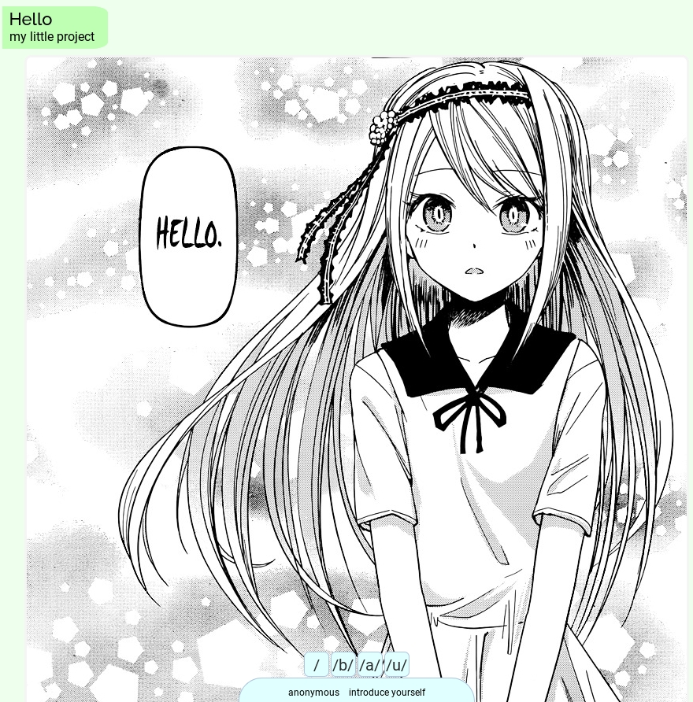
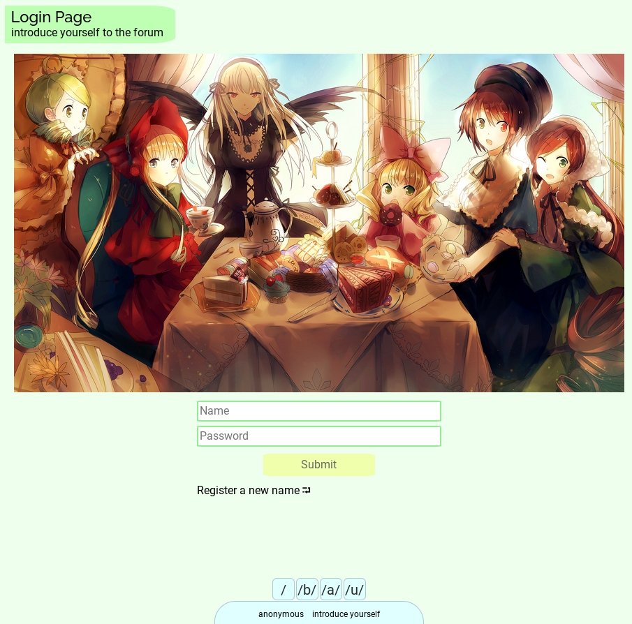
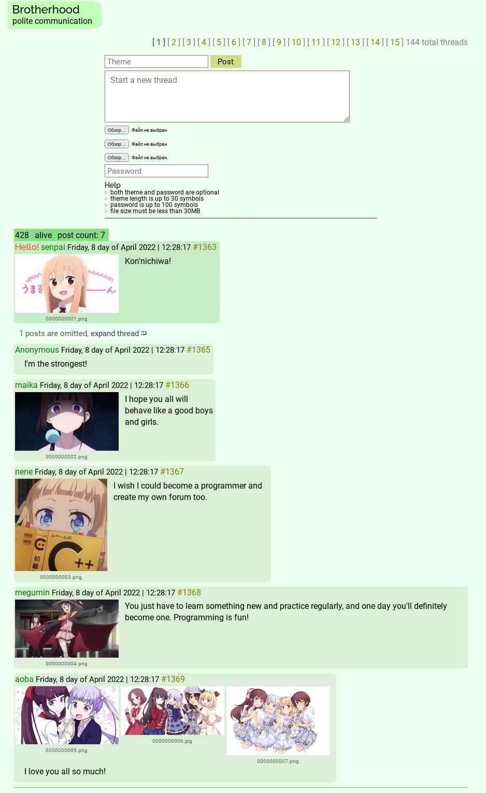

# HOWTO Forum

My imageboard-like forum on Flask.

The project was written without knowledge of architectural patterns and its design is terrible. It was quickly abandoned out of boredom. However, it works, user can register and write messages with pictures.  
Handwritten CSS. The SQLite db works through Flask-SQLAlchemy. Flask WTForms.

###### Requirements: Pipenv https://pypi.org/project/pipenv/

###### In a terminal:
0. pipenv install
1. pipenv shell
2. FLASK_APP=app.py FLASK_ENV=development flask run

##### Demo:

